# Количественный анализ текста, практика, начало
Сегодня мы начнем говорить о том, какими методами и инструментами можно делать Distant Reading и вообще количественный анализ различных текстов.  

## В прошлый раз мы [говорили](https://danilsko.github.io/slides/dhmasters2020/intro2020#/0/6) про "масштабирование Humanities"
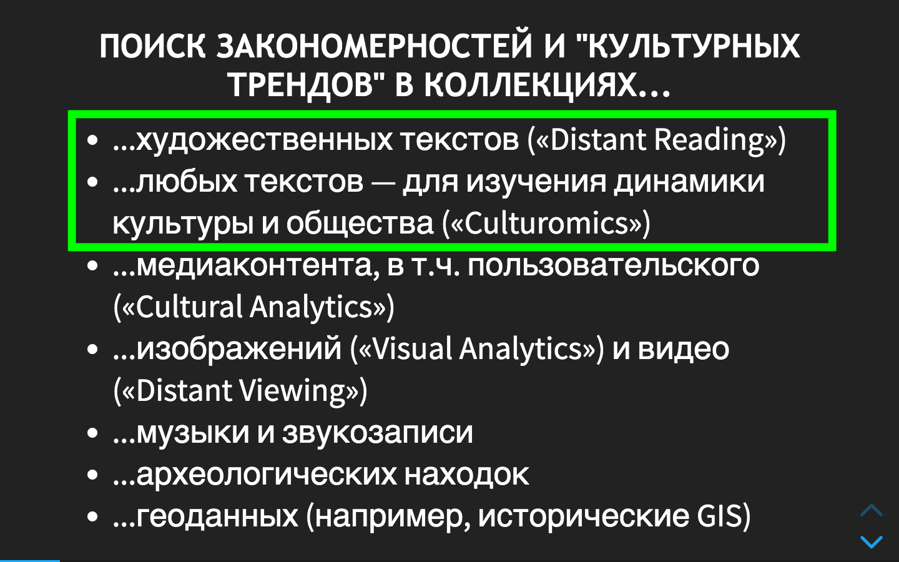

В ближайшие несколько занятий сосредоточимся на масштабировании текстовых исследований

## Как мы можем работать с большими коллекциями (корпусами) текстов?

Способы делать Distant Reading на компьютере, от базовых — к продвинутым:

## Способ 1. Использовать готовые корпуса с готовым интерфейсом (корпус Google Books с его [Ngram Viewer](https://books.google.com/ngrams), НКРЯ, корпуса в Sketch Engine и т.п.).

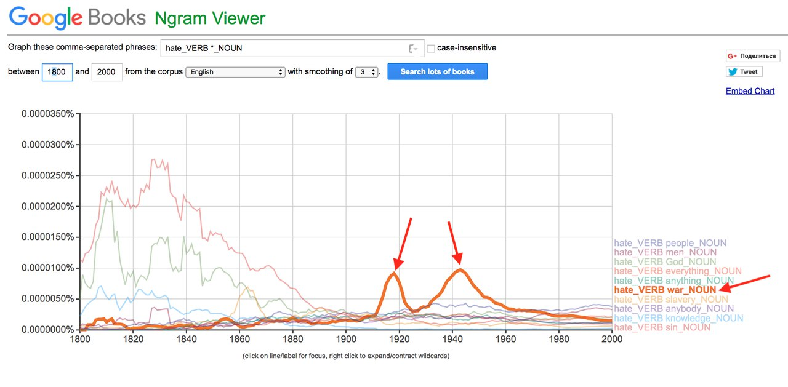

[*Воспроизвести*](https://books.google.com/ngrams/graph?corpus=15&smoothing=3&content=hate_VERB+%2A_NOUN&year_end=2019&year_start=1800&direct_url=t2%3B%2Chate_VERB%20%2A_NOUN%3B%2Cc0%3B%2Cs0%3B%3Bhate_VERB%20sin_NOUN%3B%2Cc0%3B%3Bhate_VERB%20God_NOUN%3B%2Cc0%3B%3Bhate_VERB%20war_NOUN%3B%2Cc0%3B%3Bhate_VERB%20people_NOUN%3B%2Cc0%3B%3Bhate_VERB%20men_NOUN%3B%2Cc0%3B%3Bhate_VERB%20knowledge_NOUN%3B%2Cc0%3B%3Bhate_VERB%20everything_NOUN%3B%2Cc0%3B%3Bhate_VERB%20anything_NOUN%3B%2Cc0%3B%3Bhate_VERB%20slavery_NOUN%3B%2Cc0%3B%3Bhate_VERB%20anybody_NOUN%3B%2Cc0#t2%3B%2Chate_VERB%20*_NOUN%3B%2Cc0%3B%2Cs0%3B%3Bhate_VERB%20sin_NOUN%3B%2Cc0%3B%3Bhate_VERB%20God_NOUN%3B%2Cc0%3B%3Bhate_VERB%20war_NOUN%3B%2Cc0%3B%3Bhate_VERB%20people_NOUN%3B%2Cc0%3B%3Bhate_VERB%20men_NOUN%3B%2Cc0%3B%3Bhate_VERB%20knowledge_NOUN%3B%2Cc0%3B%3Bhate_VERB%20everything_NOUN%3B%2Cc0%3B%3Bhate_VERB%20anything_NOUN%3B%2Cc0%3B%3Bhate_VERB%20slavery_NOUN%3B%2Cc0%3B%3Bhate_VERB%20anybody_NOUN%3B%2Cc0). 

Про культуромику в Google Books мы еще поговорим.

А вот примеры использования [НКРЯ](http://ruscorpora.ru) для distant reading'а:

* [A.A. Bonch-Osmolovskaya, Two Centuries of Russian Roads – Diachronic Study of Polysemy in the Context of Cultural Change](https://dh2016.adho.org/abstracts/413 "Кликни и прочти")
* [Орехов Б. В. «Проблеск» Ф. И. Тютчева в ретроспективе Корпуса. Очерк корпусной поэтики // Корпусный анализ русского стиха: Сборник научных статей. Вып. 2 / Отв ред. В. А. Плунгян, Л. Л. Шестакова. — М: Издательский центр «Азбуковник», 2014. — С. 305—319.](http://nevmenandr.net/personalia/problesk.pdf "Кликни и прочти") — здесь полу-Distant, полу-Close Reading; своего рода computer-aided (или computer-enhanced) филология.
* [Корпусный анализ русского стиха (видео Б.В. Орехова на постнауке)](https://postnauka.ru/video/85900 "Кликни и увидь")
* [А.А. Бонч-Осмоловская, Корпусные наблюдения над портретами героев в "Войне и мире"](http://www.ruthenia.ru/document/551972.html "Кликни и прочти")

#### Плюсы способа 1: дешево, низкий порог входа 👶 🍼
#### Минусы способа 1: мы ограничены И составом корпуса, И функционалом интерфейса. Мы не имеем прямого доступа к текстам 🔒 🛑

## Способ 2. Собирать корпус самому и исследовать его при помощи специализированных программ — корпусных менеджеров. 

Примеры популярных корпусных менеджеров:

* Voyant Tools
* AntConc
* Sketch Engine
* ... (и другие корпусные менеджеры, тысячи их)

## Пример: Voyant Tools

[Voyant Tools](https://voyant-tools.org/) — популярный инструмент для входа в Digital Humanities. Простой, разнообразный, но имеет ограничения.  

В Voyant есть [десятки](https://voyant-tools.org/docs/#!/guide/tools) инструментов представления корпуса, но все они могут быть сведены к трем большим категориям: 

* Анализ/визуализация **частотностей слов/N-грамм** 
* Анализ/визуализация **появления слов/N-грамм в контексте** (внутри одного текста)
* Анализ/визуализация **распределения слов/N-грамм по корпусу** 

### Загрузка текстов в Voyant Tools:

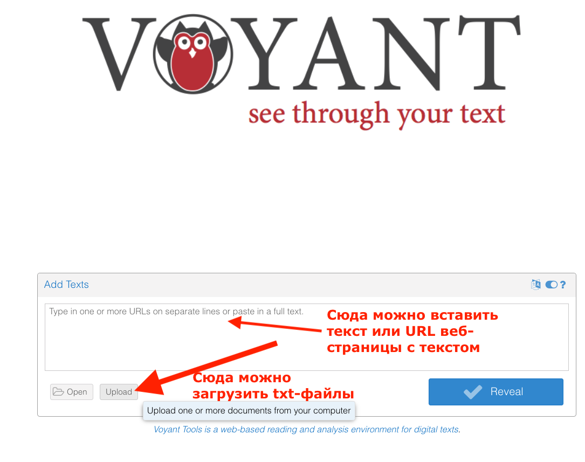

⛳ 💻 Задание: если вы никогда этого не делали — загрузите, пожалуйста, в Voyant любой достаточно крупный (не менее 50 кб) *русский* текст или корпус. Можете создать файл(ы) сами, найти у себя, в крайнем случае — возьмите [этот](data/Dostoevsky_PrestuplenieINakazanie.txt).

☝️ Voyant делает вашему корпусу уникальный URL, по которому корпус будет доступен в интернете. Вот несколько примеров уже загруженных мной корпусов: 

* [Главная страница Интерфакса за 3 месяца: январь-март 2014](https://voyant-tools.org/?corpus=8943e7b961f87daf226162f5a3f5e8da). 
* [Преступление и наказание](https://voyant-tools.org/?corpus=5eb30cfa1d1f75ee217e92c9a8af2726)
* ["Война и мир" по томам](https://voyant-tools.org/?corpus=d6d851113e8787d79055aa1b434a37bd)
* [Корпус фантастики, собранный в прошлом году нынешним вторым курсом; около 150 мб фантастических текстов](https://voyant-tools.org/?corpus=ad00c40ec4549bc30c185cf7f65c9318). 

### Смотрим частотности слов и конструкций в Voyant

Перед загрузкой я лемматизировал корпус фантастики (подробнее об этом дальше в нашем курсе). Поэтому вордклауд, который вам по умолчанию выдает Voyant в левом окошке, в нашем случае основан на частотностях лемм ☝️

*почти 33 тыс. раз упоминаются люди и человеки в корпусе фантастики*

Через Scale можно выбрать показ облака для всего корпуса, или для отдельных документов. При помощи слайдера под облаком можно отрегулировать количество слов в облаке. 

Сами частотности можно посмотреть во вкладке Terms (кнопка над облаком):

### Добавление/редактирование списка стоп-слов

    
Как видите, тут довольно много служебных и околослужебных слов, которые нам неинтересны, вроде свой. А еще совсем недавно Voyant вообще не знал русских стоп-слов, и при первой загрузке получалось что-то такое:

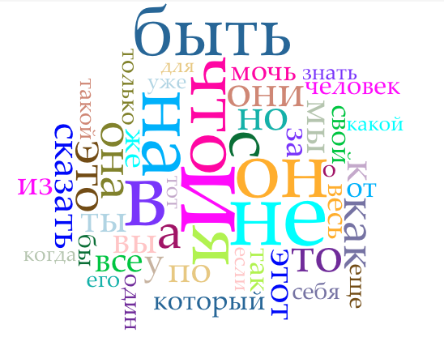

К счастью, в Voyant есть функционал заливки списка стоп-слов. Можно вставить туда свой список:

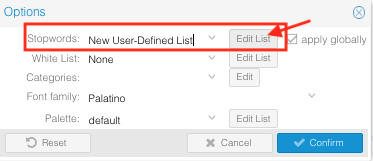

Вот мои [стоп-слова](data/stop_ru.txt), украденные откуда-то из интернета. После применения стоп-слов получается что-то такое: 

*Корабль? Машина? Это уже чуть-чуть интереснее!*

⛳ 💻 Задание: загрузите в ваш корпус список стоп-слов и получите отфильтрованные частотности. 

Окей, мы получили отфильтрованные частотности. Что делать, если я хочу эту табличку себе на компьютер? А вот что:

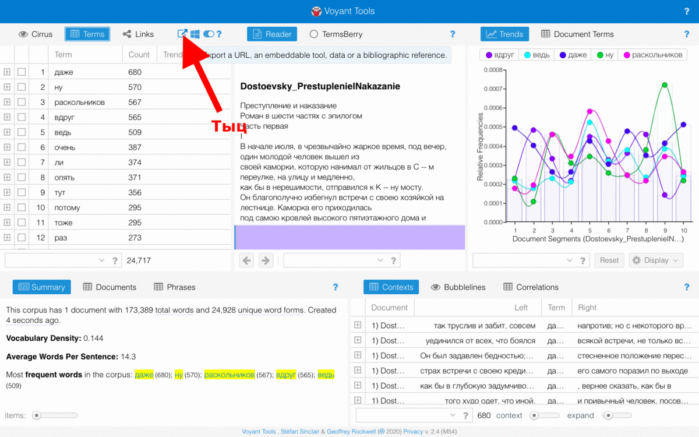 

⛳ 💻 Задание: теперь попробуйте выгрузить себе на компьютер:

1. Частотности в виде таблицы
2. Визуализацию в виде облака

### Строим графики 📈

Voyant часто используют для построения графиков (а ля Google Ngram Viewer, но на вашем материале). Если ваш корпус имеет временн*у*ю протяженность, это бывает интересно. 

Ср. например, радио* (т.е. все слова, начинающиеся на "радио") и слово компьютер:

А вот пример из корпуса [Интерфакса за январь-март 2014](https://voyant-tools.org/?corpus=8943e7b961f87daf226162f5a3f5e8da) — слова "украина","олимпиада", "крым":

Показать пример из ["Войны и мира"](https://voyant-tools.org/?corpus=d6d851113e8787d79055aa1b434a37bd)

##### Коллокации в Voyant
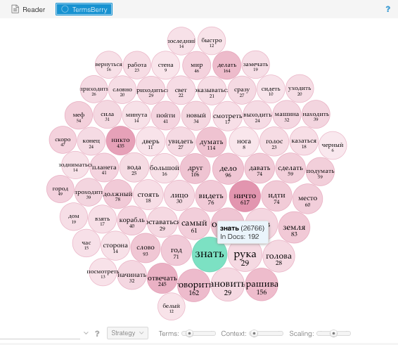

TermsBerry предоставляет такую же визуализацию частотных слов, что и Cirrus, но более полезна для исследования коллокатов: при наведении на слово подсвечиваются слова, которые встречаются рядом с выделенным. Грубо говоря, когда одно слово "предсказывает", повышает вероятность встретит другое рядом. 

* Определение “рядом”, то есть того, на каком расстояние слово должно находиться от выделенного чтобы считаться соседним, можно отрегулировать при помощи слайдера Context. 

* Во вкладке Strategy можно переключиться между просто частотными словами, и “значимыми” словами - которые могут встречаться редко, но в определенных документах намного чаще, чем в других.

### Прочие окошки в Voyant 

#### Reader

Панель Reader позволяет просматривать корпус как один непрерывный текст. Расположение читаемого текста относительно всего корпуса представлено внизу в виде разноцветных столбиков. Каждый столбик - это отдельный документ в корпусе. Его высота и ширина зависят от объема этого документа.
При наведении на слово можно посмотреть на его частоту в документе.

#### Summary
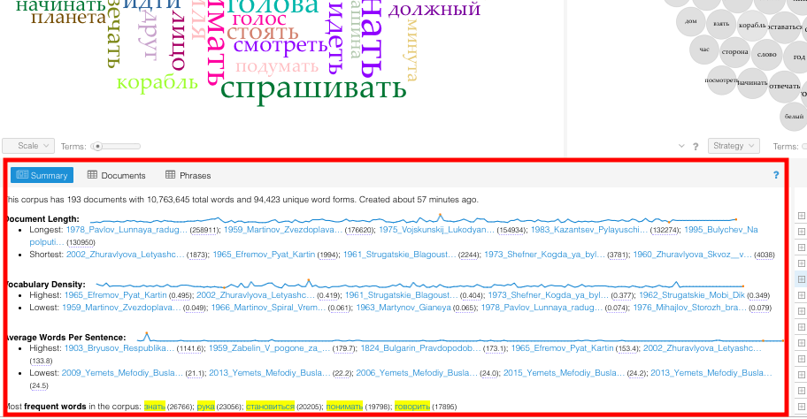
Панель Summary предлагает различную информацию и статистику о корпусе вообще и о некоторых документах: самые значимые слова для разных документов, количество слов в документе, среднюю длину предложений и т.д.
Также умеет выделять "наиболее специфические" слова данного корпуса. 

#### Тематическое моделирование

Воянт умеет топик моделинг, можно посмотреть на примере ["Войны и мира"](https://voyant-tools.org/?corpus=d6d851113e8787d79055aa1b434a37bd). Но это не самый удобный инструмент для ТМ.

### Полезный факт: Voyant Tools можно запускать и локально

Для установки локально надо скачать Voyant Server [отсюда](http://docs.voyant-tools.org/resources/run-your-own/voyant-server/) (тут же есть все инструкции) и еще установить Java. После запуска VoyantServer.jar ваш компьютер запустит локальный сервер, который будет делать то же самое, что и онлайновый Voyant, но прямо на вашем компьютере. 

<!-- **Сейчас качать Voyant Server через вышкинскую сеть не надо, он тяжелый; мы поиграем с веб-версией, которой все обычно и пользуются** -->

## Ну и напоследок: 

[текст про Voyant от Data Sitters Club](https://datasittersclub.github.io/site/dsc6/) с очень хорошим трибьютом Стивену Синклэру. 

### AntConc

[AntConc](http://www.laurenceanthony.net/software/antconc/) — "саперная лопатка" в мире корпусных менеджеров. То есть максимально простой инструмент, но с ограниченными возможностями. Тем не менее, там есть кое-что, чего нет в Voyant. Например:

* Более умные меры подсчета коллокаций
* Возможность загрузить словарь лемм (вот [такой](data/lemma_list_ru.txt) — осторожно, 60 МБ), чтобы тексты лемматизировались прямо внутри программы.
* Контрастивный анализ (выделение слов, которые характеризуют *ваш* корпус относительно какого-то референтного корпуса)

Когда-то я написал небольшой [туториал по AntConc](https://docs.google.com/document/d/1OA4ZAmygRUtkia4hs6qIDPGZKvh62PBxdcl7dR1qf5E/edit#) для бакалавров Вышки. Вы можете использовать его как референс. 

⛳ 💻 Задание: установите [AntConc](http://www.laurenceanthony.net/software/antconc/) (достаточно просто скачать его на компьютер; можно взять файл у меня). Вытащите из вашего корпуса или текста список 3-грамм, которые встречаются там не реже 4 раз. 

### SketchEngine

Ни один из упомянутых выше корпусных менеджеров не содержит в себе никаких настоящих *лингвистических* инструментов. Voyant или AntConc не умеют приводить слова к начальной форме, не умеют находить вам все прилагательные и т.п. Фактически для них тексты — это просто цепочки символов (токены), разделенные пробелами. Все инструменты в Voyant или AntConc опираются только на это.   

[SketchEngine](https://www.sketchengine.eu/) — более сложный *лингвистический* инструмент. Здесь загрузив свой корпус, вы можете, например, посмотреть все прилагательные, описывающие то или иное слово ("человек" какой: молодой, старый, грустный...), или наоборот все слова, к которым ваше слово присоединяется как притяжательное дополнение ("человека" что: судьба, воля, действие), или все слова, которые присоединяются предложно через предлог в:

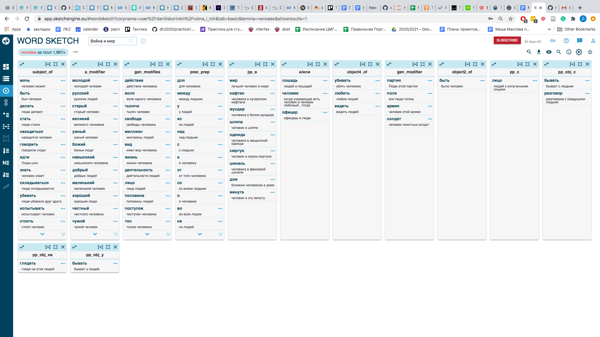

SketchEngine — это одновременно веб-интерфейс к куче готовых больших корпусов (на миллиарды словоупотреблений) и корпусный менеджер, в который можно загрузить свой корпус. Но ваш корпус будет ограничен миллионом словоупотреблений, что не очень много (это примерно половина всех текстов Л.Н. Толстого, имеющихся в НКРЯ). Загрузить свой корпус несложно:

1. Зарегистрируйтесь на [SketchEngine](https://www.sketchengine.eu/), получите 30-дневный Free Trial (лафйхак: его потом можно получать сколько угодно раз, регистрируясь с новой почтой)

2. Создайте новый корпус:

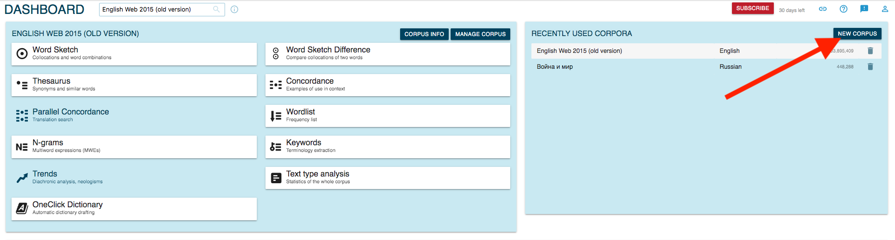

3. Загрузите ваши тексты

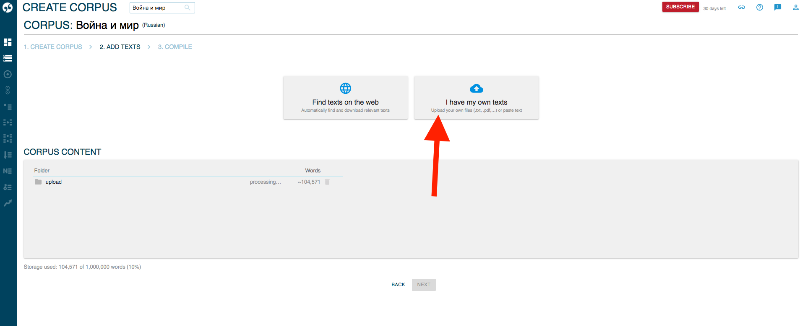

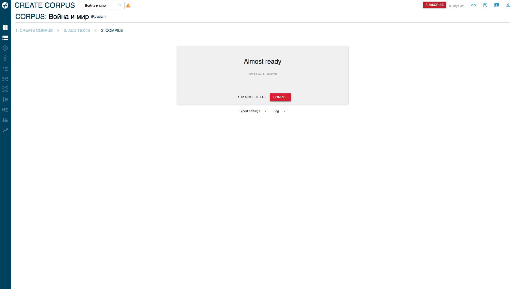

4. Нажмите 'Compile'...

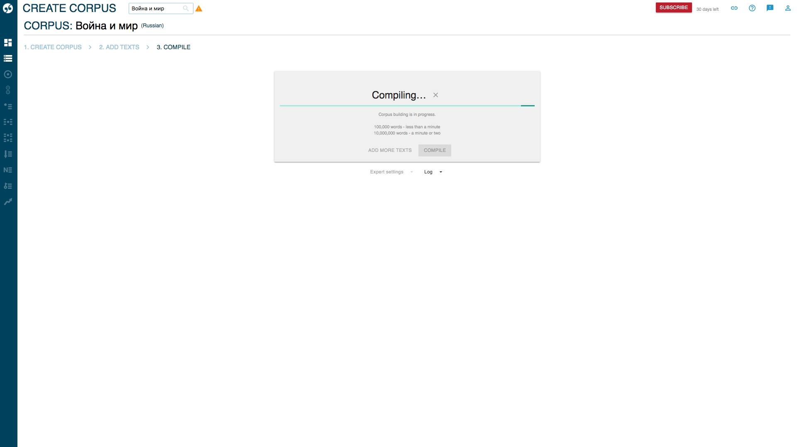

5. Вы великолепны. Можете изучать сочетаемость слов (вкладка Word Sketches), сравнивать эти лингвистические скетчи между собой и прочее

⛳ 💻 Задание: если вы никогда этого не делали — загрузите, пожалуйста, в SketchEngine любой достаточно крупный (не менее 50 кб) *русский* текст или корпус.

#### Плюсы способа 2: тоже дешево, тоже низкий порог входа, возможность определять состав корпуса
#### Минусы способа 2: мы все еще ограничены возможностями инструмента (функционал, объем загружаемых текстов)

### Способ 3. Do it yourself, dammit 👩‍💻🛠️😎

#### Как вы уже поняли, у всех готовых инструментов есть серьезные ограничения. 

Вы не можете запихнуть в AntConc/ Voyant / SketchEngine 1ГБ текста, не можете сделать внутри них всю нужную вам пред- или постобработку (например, лемматизацию — в AntConc/ Voyant ее просто нет, но и в Sketch Engine вы ее не контролируете).

А самое главное: **ВЫ ОСТАЕТЕСЬ ПОЛЬЗОВАТЕЛЕМ ПРОДУКТА**. А круто быть разработчиком.
Пока мы пользуемся каким-то продуктом, мы зависимы от него. Веб-приложение могут закрыть, программу перестанут поддерживать. 
И если что-то не работает, нам остается только грустить: ведь все спрятано под капотом (в крайнем случае вы можете завести issue на гитхабе разработчиков, если продукт опен-сорсный... но вряд ли вы будете готовы пофиксить баг сами и написать pull-request, который к тому же еще должны принять).

### Поэтому мы стремимся к тому, чтобы реализовывать нужные нам вещи самостоятельно, программируя их.

Так мы гораздо меньше зависим от других, а если что-то сломалось, *обычно* можем найти, что и почему. Если что-то не работает, мы можем придумать обход, использовать другую библиотеку, сделать по-другому и т.п. 

Ну, или найти решение на Stack Overflow (так решаются 95% проблем в программировании). 

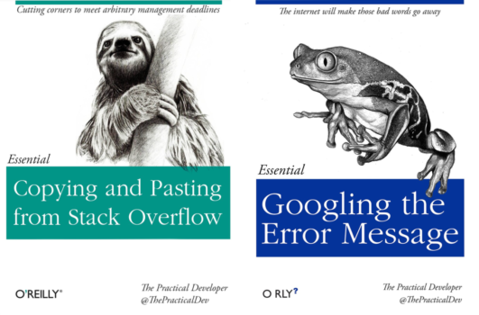

### Поэтому дальше мы будем делать Distant  Reading в Питоне, как взрослые.

* Порисуем там графики частотности слов
* Разберемся, как учитывать морфологию
* Визуализируем распределение слов по тексту
* ... and more.

<!-- ## [За мной, читатель!](https://colab.research.google.com/drive/11fLA0gopcwT785gIxoOc-wgZ3dyIyyt2?usp=sharing) -->